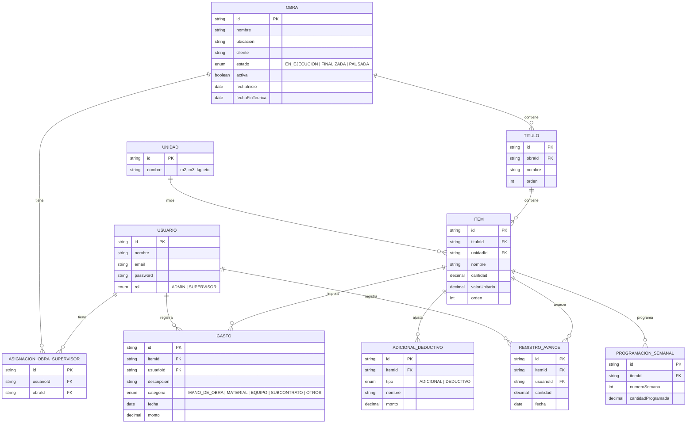

# Diagrama Entidad-Relación — Kembron Gestión de Obras

Modelo de datos completo del sistema, con sus 10 entidades y relaciones.

## Notas del modelo

- **Usuario** tiene rol `ADMIN` o `SUPERVISOR`. Un supervisor puede estar asignado a varias obras, y una obra puede tener varios supervisores (relación muchos a muchos vía `AsignacionObraSupervisor`).
- **Obra → Título → Ítem** es una jerarquía de 3 niveles: una obra tiene varios títulos (etapas), cada título tiene varios ítems (tareas ejecutables).
- **Unidad** es una entidad propia (no un enum fijo) para poder agregar nuevas unidades de medida sin tocar código.
- **AdicionalDeductivo**, **Gasto**, **ProgramacionSemanal** y **RegistroAvance** cuelgan todos de un **Ítem** — son los cuatro tipos de eventos/ajustes que se registran sobre una tarea ejecutable.
- **Gasto** y **RegistroAvance** también se relacionan con **Usuario**, para saber quién cargó cada dato.
- Todas las relaciones desde `Obra` hacia abajo (Título → Ítem → AdicionalDeductivo/Gasto/ProgramacionSemanal/RegistroAvance) son `onDelete: Cascade` — si se borra una obra, se borra toda su información asociada.
- Las relaciones hacia `Usuario` y `Unidad` son `onDelete: Restrict` — no se puede borrar un usuario o unidad que ya esté en uso, para no perder historial.
